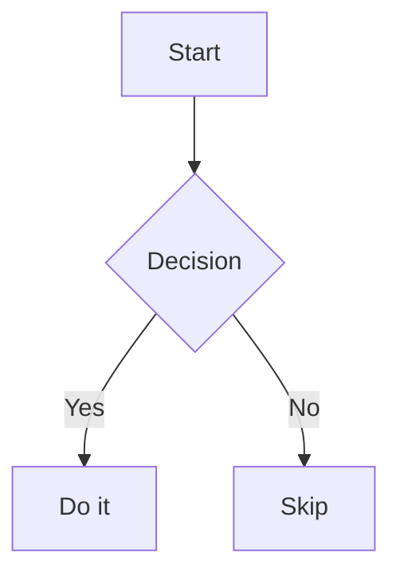

# Obsidian Flavored Markdown

Obsidian extends standard Markdown with wikilinks, embeds, callouts, properties, and more. Use this skill whenever writing or editing notes destined for Matt's Vault or the Claude Context Library (CCL).

---

## Wikilinks

Internal vault links use double brackets.

```
[[Note Name]]                         # Link by note name
[[Note Name|Display Text]]            # Link with custom display text
[[Note Name#Heading]]                 # Link to a specific heading
[[Note Name#^block-id]]               # Link to a specific block
[[Folder/Note Name]]                  # Link with path (use when names are ambiguous)
```

Use wikilinks for all vault-internal links. Use standard Markdown links `[text](url)` only for external URLs.

---

## Embeds

Prefix a wikilink with `!` to embed the content inline. See `references/EMBEDS.md` for full syntax.

```
![[Note Name]]                        # Embed full note
![[Note Name#Heading]]                # Embed specific section
![[image.png|300]]                   # Embed image, 300px wide
![[document.pdf#page=3]]             # Embed PDF at specific page
```

---

## Callouts

Use callouts to highlight information blocks. See `references/CALLOUTS.md` for all types and foldable syntax.

```
> [!note]
> Standard note callout.

> [!warning] Custom Title
> Warning with a custom title.

> [!tip]- Collapsed tip
> Only visible when expanded.
```

Supported types: `note`, `info`, `tip`, `warning`, `danger`, `success`, `question`, `bug`, `example`, `quote`, and aliases (`abstract`, `summary`, `tldr`, `hint`, `important`, `check`, `done`, `help`, `faq`, `caution`, `attention`, `failure`, `fail`, `missing`, `error`, `cite`).

---

## Properties (Frontmatter)

YAML properties go between `---` delimiters at the very top of a file. See `references/PROPERTIES.md` for full detail.

### Standard frontmatter for all new notes in Matt's Vault

```yaml
---
type: runbook          # required — see types below
tags:
  - homelab/docker
created: 2026-03-16    # required — YYYY-MM-DD
updated: 2026-03-16    # optional
status: active         # optional — active | paused | completed | archived
priority: medium       # optional — high | medium | low
parent: "[[00-Meta/_index]]"  # optional — wikilink to parent note
---
```

**Required fields:** `type`, `tags`, `created`
**Optional fields:** `updated`, `status`, `priority`, `parent`

### Note type values
- General: `runbook`, `project`, `reference`, `template`, `index`
- Medical: `soap-note`, `discharge-summary`, `clinical-note`, `study-note`
- Personal: `log`, `plan`, `reflection`
- Polaris: `polaris` (see polaris skill)

---

## Tags

Inline tags use `#tag` syntax. Nested tags use `/` separator.

```
#project/active
#homelab/docker
#priority/high
#source/web
#type/runbook
```

### Matt's Vault tag taxonomy

**EchoNote families (medical):**
- `#source/*` — origin of clinical information (e.g., `#source/uptodate`, `#source/textbook`)
- `#specialty/*` — medical specialty (e.g., `#specialty/cardiology`, `#specialty/peds`)
- `#type/*` — note type within medical context (e.g., `#type/soap-note`, `#type/reference`)

**Personal/technical families:**
- `#homelab/*` — homelab topics (e.g., `#homelab/docker`, `#homelab/pihole`, `#homelab/talia`)
- `#project/*` — projects (e.g., `#project/active`, `#project/completed`)
- `#priority/*` — priority flags (e.g., `#priority/high`, `#priority/low`)

Use frontmatter `tags:` list for primary categorization. Inline `#tags` are fine for ad-hoc annotation mid-note.

---

## Matt's Vault Folder Conventions

Folders use a two-digit numeric prefix for ordering. Never create a folder without a prefix.

```
00-Meta/           — vault meta, templates, _index files
01-Polaris/        — Polaris system (goals, anchors, weeks)
10-Medical/        — clinical notes, study materials
20-Technology/     — code, infrastructure, AI
40-Projects/       — active projects
50-Personal/       — personal notes, travel, life admin
90-Archive/        — inactive/archived material
99-Templates/      — Obsidian templates
```

Sub-folders follow the same pattern within their parent (e.g., `10-Medical/Clinical-Practice/`, `20-Technology/Infrastructure/Homelab/`).

### `_index.md` pattern

Every folder should have an `_index.md` file that:
- States the folder's purpose in one sentence
- Lists key sub-folders or recurring note types
- Links to important notes within the folder via wikilinks

Example:
```markdown
---
type: index
tags:
  - homelab
created: 2026-01-01
---

# Homelab

Infrastructure and self-hosting notes.

## Key notes
- [[docker-homelab]] — full services table
- [[service-gotchas]] — per-service config issues
```

---

## Other Syntax

### Highlights
```
==highlighted text==
```

### Comments (hidden from reading view)
```
%% This text is hidden in reading view %%
```

### Footnotes
```
This has a footnote.[^1]

[^1]: Footnote content here.
```

### LaTeX math
```
Inline: $e^{i\pi} + 1 = 0$
Block:
$$
\sum_{n=1}^{\infty} \frac{1}{n^2} = \frac{\pi^2}{6}
$$
```

### Mermaid diagrams
````

````

### Task lists
```
- [ ] Open task
- [x] Completed task
- [/] In-progress task (Obsidian extended)
- [-] Cancelled task (Obsidian extended)
```

---

## Reference Files

- `references/CALLOUTS.md` — full callout syntax and type list
- `references/EMBEDS.md` — all embed variants
- `references/PROPERTIES.md` — frontmatter property types and standard fields
